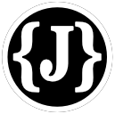
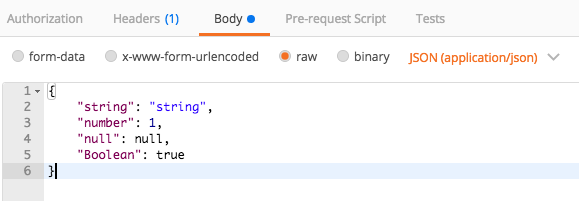

# NodeJS_MockJsonAPI_server


- [NodeJS](https://nodejs.org)
- [PM2](https://www.npmjs.com/package/pm2)
- [express](https://www.npmjs.com/package/express)
- [JSON Editor](https://github.com/josdejong/jsoneditor)

# Install & Start

- Unit Test ([mocha](https://www.npmjs.com/package/mocha))
```shell
$ npm run test
```

- ENV development (default PORT : 13000)
```shell
$ npm ci
$ npm run dev
or
$ npm ci
$ npm run dev-start
```

- ENV production (default PORT : 80)
```shell
$ npm ci
$ npm run start
or
$ npm run deploy
```

## RESTful API
- Content-Type : application/json
- GET : Read
- DELETE : Delete
- POST : Create , Read
- PUT : Update, Create



## Read API PATH
```
http://localhost:13000/test       --> find `test.json` file
http://localhost:13000/test.json  --> find `test.json` file
http://localhost:13000/test/      --> find a file list in the `test` directory
```
